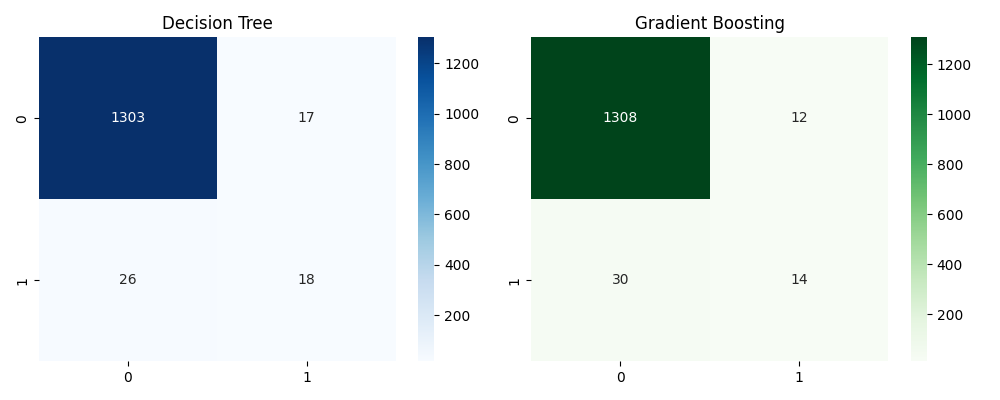
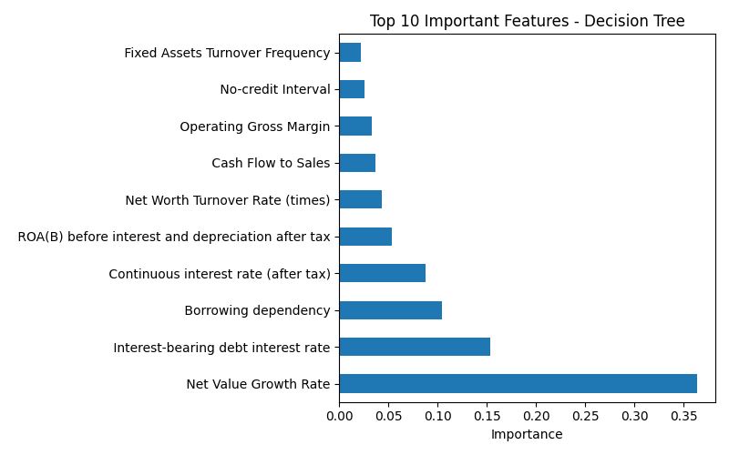

# 🏦 Corporate Bankruptcy Prediction

A machine learning study comparing **Decision Tree** and **Gradient Boosting** classifiers for predicting corporate bankruptcy using financial ratio data.

## 📌 Overview

Corporate bankruptcy prediction is a challenging classification problem because bankrupt companies represent only a small fraction of the overall dataset.

This project builds and compares two machine learning approaches:

* 🌳 **Decision Tree**
* 🚀 **Gradient Boosting**

The models classify companies as **bankrupt or non-bankrupt** using **95 financial indicators**.

The project focuses not only on accuracy, but also on **Precision, Recall, and F1-Score**, which are particularly important when dealing with highly imbalanced financial data.

---

## 📊 Dataset

**Dataset:** Taiwanese Bankruptcy Prediction Dataset

**Source:** Kaggle / UCI

* **Companies:** 6,819
* **Features:** 95 financial indicators
* **Target:** `Bankrupt?`

  * `0` → Non-bankrupt
  * `1` → Bankrupt
* **Class distribution:**

  * 96.8% Non-bankrupt
  * 3.2% Bankrupt

> **Note:** This project uses the publicly available Taiwanese bankruptcy dataset. Extending the analysis to Indian corporate financial data is included in the future scope.

---

## 🧠 Machine Learning Approach

### 1. Data Preparation

The dataset is loaded using Pandas and divided into:

* **Features (X):** 95 financial indicators
* **Target (y):** Bankruptcy status

The data is split into:

* **80% Training data**
* **20% Testing data**

Stratified splitting is used to preserve the class distribution.

### 2. Decision Tree

A Decision Tree classifier is used as an interpretable baseline model.

```python
DecisionTreeClassifier(
    max_depth=5,
    random_state=42
)
```

### 3. Gradient Boosting

Gradient Boosting is used as an ensemble learning model for comparison.

```python
GradientBoostingClassifier(
    n_estimators=100,
    random_state=42
)
```

### 4. Evaluation

Both models are evaluated using:

* Accuracy
* Precision
* Recall
* F1-Score
* Confusion Matrix

---

## 📈 Model Results

| Metric    | Decision Tree | Gradient Boosting |
| --------- | ------------: | ----------------: |
| Accuracy  |    **96.85%** |        **96.92%** |
| Precision |        51.43% |        **53.85%** |
| Recall    |    **40.91%** |            31.82% |
| F1-Score  |    **45.57%** |            40.00% |

### 🔍 Key Observation

Although both models achieve high overall accuracy, the dataset is highly imbalanced.

The **Decision Tree achieved higher Recall and F1-Score**, meaning it identified a larger proportion of the actual bankruptcy cases in this experiment.

This demonstrates why **accuracy alone can be misleading when evaluating models on imbalanced datasets**.

---

## 📊 Model Analysis

### Confusion Matrices

The confusion matrices provide a detailed view of correct and incorrect predictions made by each model.



### Feature Importance

The Decision Tree was also analyzed to identify the financial indicators that contributed most strongly to its predictions.



---

## 🔑 Top Predictive Features

The top features identified by the Decision Tree include:

1. **Net Value Growth Rate**
2. **Interest-bearing Debt Interest Rate**
3. **Borrowing Dependency**
4. **Continuous Interest Rate (after tax)**
5. **ROA(B) before interest & depreciation, after tax**

These features provide insight into the financial characteristics associated with the model's bankruptcy predictions.

> Feature importance indicates the contribution of variables to this trained model; it should not be interpreted as proof of causal relationships.

---

## 📄 Project Report

A detailed report containing the methodology, analysis, results, and visualizations is available here:

**[📑 View Full Project Report](reports/Bankruptcy_Prediction_Report.pdf)**

---

## 🛠️ Tech Stack

| Technology   | Purpose                            |
| ------------ | ---------------------------------- |
| Python       | Machine Learning & Data Processing |
| Pandas       | Data Manipulation                  |
| NumPy        | Numerical Computing                |
| Scikit-learn | Model Training & Evaluation        |
| Matplotlib   | Data Visualization                 |
| Seaborn      | Statistical Visualization          |
| Git & GitHub | Version Control                    |

---

## 📁 Project Structure

```text
bankrupty-prediction/
│
├── data/
│   └── bankrupty_data.csv
│
├── src/
│   └── bankrupty_pipeline.py
│
├── reports/
│   ├── feature_importance.png
│   ├── confusion_matrices.png
│   └── Bankruptcy_Prediction_Report.pdf
│
├── .gitignore
└── README.md
```

---

## ▶️ How to Run

### 1. Clone the repository

```bash
git clone https://github.com/talarishivapavanitalari-hub/bankrupty-prediction.git
cd bankrupty-prediction
```

### 2. Install dependencies

```bash
pip install pandas numpy scikit-learn matplotlib seaborn
```

### 3. Run the pipeline

```bash
python src/bankrupty_pipeline.py
```

---

## 🔮 Future Scope

Potential extensions of this project include:

* Apply **SMOTE** and class-weighting techniques for handling class imbalance
* Compare additional models such as **Random Forest, XGBoost, and LightGBM**
* Perform **hyperparameter tuning**
* Add cross-validation for more robust evaluation
* Extend the analysis to **Indian corporate financial data**
* Explore explainable AI techniques such as **SHAP**
* Develop an interactive dashboard for bankruptcy risk analysis

---

## 🎯 Learning Outcomes

Through this project, I explored:

* Supervised machine learning
* Binary classification
* Decision Tree learning
* Ensemble learning with Gradient Boosting
* Imbalanced datasets
* Model evaluation beyond accuracy
* Feature importance
* Confusion matrix analysis
* Data visualization
* Reproducible ML workflows

---

## 👤 Author

**Pavani Talarishiva**

B.Tech — Computer Science & Engineering

Interested in **Machine Learning, Data Science, Business, and Entrepreneurship**.

---

⭐ If you found this project interesting, feel free to explore the repository and the full project report.
